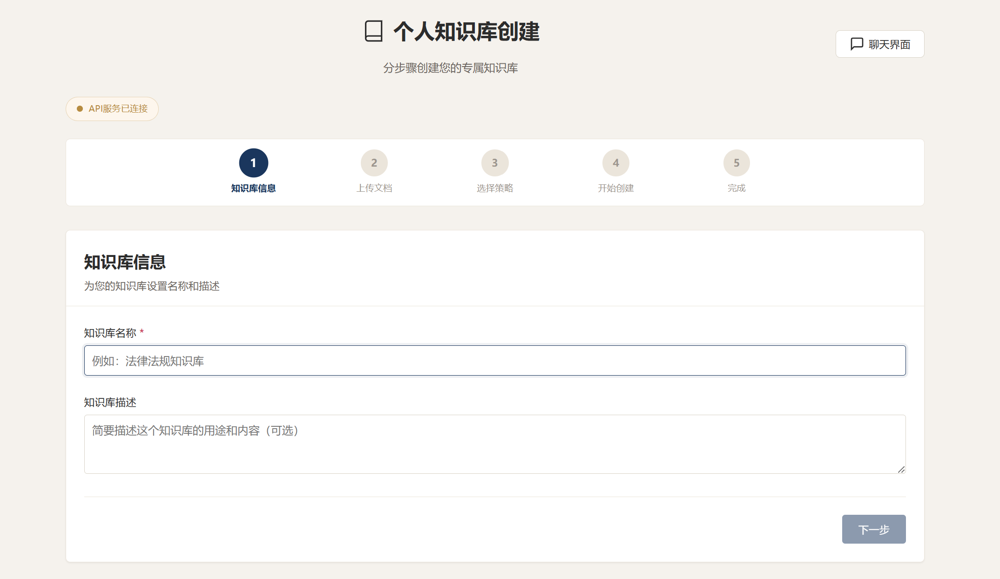
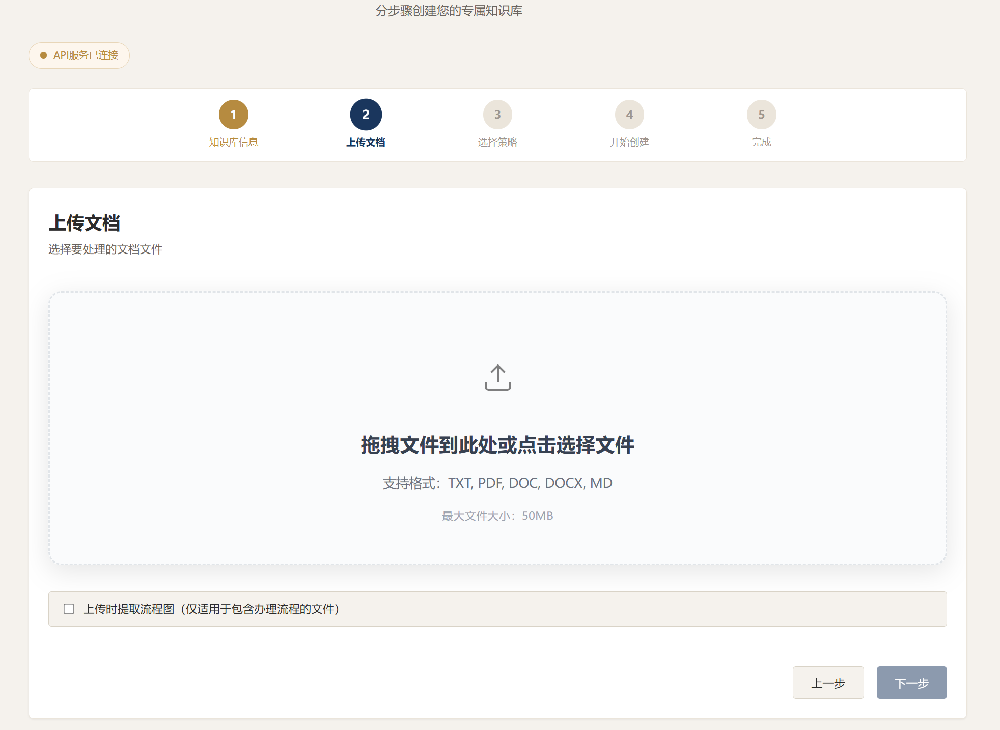
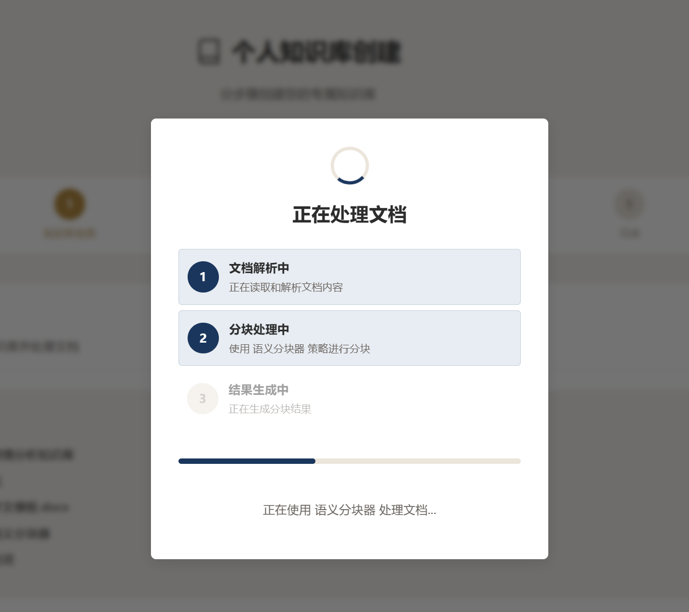
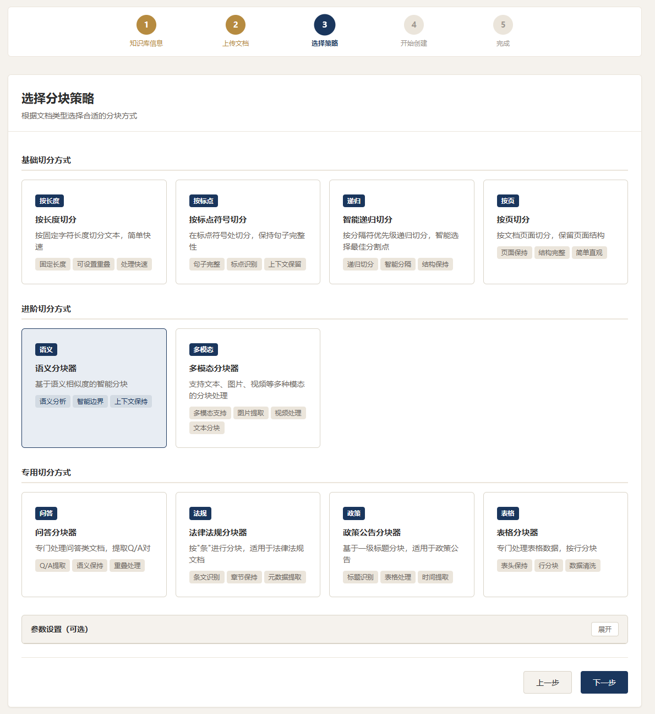
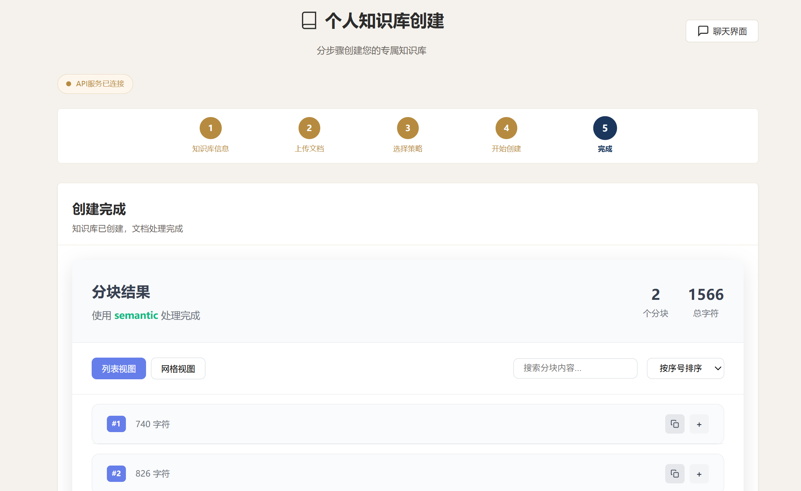
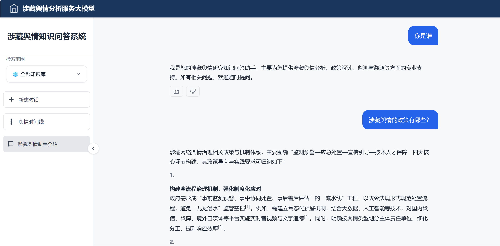
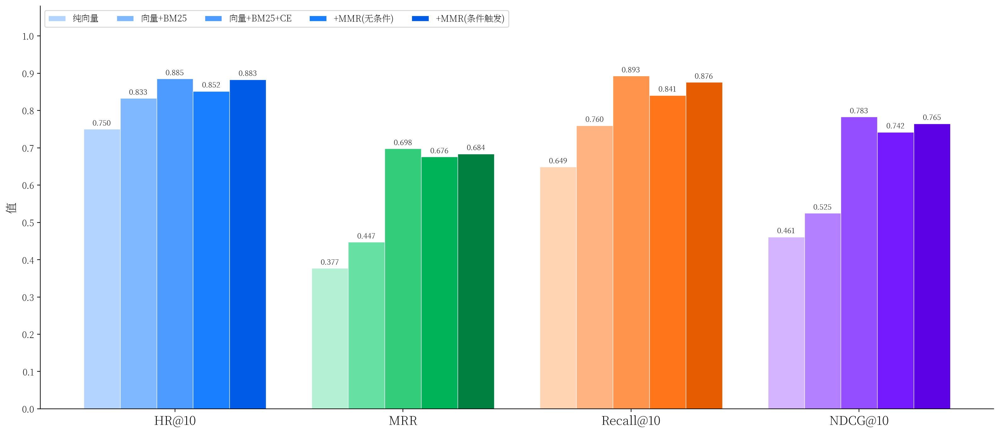

# 涉藏舆情知识问答 RAG 系统

一个面向涉藏舆情研究场景的检索增强生成（RAG）知识问答平台。围绕政策文件、舆情案例与研究文献构建可检索、可溯源、可追问的问答系统，并配套面向管理员的知识库运营后台。

## ✨ 核心特性

### 混合检索管线
- **语义检索 + BM25 稀疏检索**，通过 RRF（Reciprocal Rank Fusion）融合两路召回结果
- **CrossEncoder 重排序**（本地 `bge-reranker-large` / 远程 API 两种模式可切换）
- **自适应阈值过滤**：低于置信阈值时判定"无相关证据"并直接拒答，避免幻觉
- **条件触发 MMR 多样性重排**：基于 `token_set_ratio` 检测候选文本重叠度，仅在候选集存在实质性重复时才启用 MMR，避免对已经足够多样的召回结果做无意义的二次重排
- **中/藏/英混合分词**：中文用 jieba，藏文基于音节点（tsheg, U+0F00–U+0FFF）规则分词，专门解决涉藏文献中三语混排场景下 BM25 检索质量差的问题

### 语义分块
- 从零实现经典 **TextTiling 算法**（Hearst, 1997）：句子切分 → 本地 TF-IDF 稀疏向量 → 滑动窗口计算相邻文本块余弦相似度 → 深度得分定位相似度谷底 → 自适应阈值（均值 + 0.5×标准差）确定主题边界
- 该模块不依赖任何 embedding API，纯本地计算，无网络请求
- 另配套问答分块、法律法规分块（按"条"切分）、政策公告分块、表格分块等多种策略，支持 txt/pdf/docx/xlsx 输入

### 本地化推理，降低外部依赖
- Embedding 默认使用本地 **bge-large-zh**（1024 维），通过 `sentence-transformers` 底层 API 调用（绕开上层框架在新版本 PyTorch 下的负索引兼容性问题）
- 重排序默认使用本地 **bge-reranker-large**，进程内推理、自动检测 GPU，不再需要独立的 Flask 微服务
- 阿里云百炼 DashScope（Qwen 系列）作为兼容/多模态场景的备选方案保留，仅 LLM 生成环节仍需联网

### 多模态统一检索
表格转 JSON 文本参与嵌入，图像走远程多模态编码模型（`tongyi-embedding-vision-plus`），ChromaDB 中存占位符，回答时按需将图像以 base64 形式回传前端 —— 实现异构内容统一走同一套稀疏 + 稠密检索管线。

### 性能与工程细节
- **三层惰性加载架构**：路由级懒加载视图 → `_ensure_hybrid_imports()` 延迟加载重型依赖（LangChain / Chroma / 混合检索模块）→ 分块器按需导入，显著优化服务冷启动耗时
- **BM25 索引的 mtime 缓存失效策略**：以索引目录修改时间作为版本号判断缓存是否有效，无 TTL、无过期数据，天然保证一致性
- 附带消融实验脚本（`backend/tests/ablation_experiments.py`），可量化对比纯向量 / 向量+BM25 / +CrossEncoder / +MMR 全链路四档配置下的检索准确率（Top-K 命中率、MRR、Recall、NDCG），以及分层测量冷启动各环节耗时

### 舆情时间线抽取
从已入库文档中抽取时间信息（含藏历纪年识别）与事件关键词，生成结构化时间线并在前端可视化，帮助梳理事件脉络。

### 知识库运营后台
- `KnowledgeBase → Document → DocumentVersion` 三层数据模型，支持文档多版本管理与回滚
- 独立管理员账号体系（超级管理员 / 知识库管理员两级角色）与操作审计日志
- 用户反馈闭环：用户可对回答标注"回答错误 / 幻觉内容 / 内容过期 / 引用错误"等类型，反馈关联到具体召回片段，管理员据此下架 / 修改 / 重新发布文档
- 基于用户画像（角色、年龄段、活跃度）动态调整回答语气与详略程度

## 🏗️ 技术架构

| 层级 | 技术选型 |
|---|---|
| 前端 | Vue 3 + TypeScript + Vite + Pinia + vue-router |
| 后端主服务 | Django |
| 向量数据库 | ChromaDB |
| 稀疏检索 | BM25（`rank_bm25`） |
| 重排序 | 本地 `bge-reranker-large`（默认）/ DashScope `qwen3-rerank`（可选） |
| Embedding | 本地 `bge-large-zh`（默认）/ DashScope 多模态向量模型（可选） |
| LLM | 阿里云百炼 DashScope（Qwen 系列，如 `qwen3.7-max`） |
| Agent / 流程图 | LangGraph + Graphviz |

## 📁 目录结构

```
.
├── backend/                   # Django 后端主服务
│   ├── chunker_api/           # 核心业务应用
│   │   ├── rag/                # RAG 问答编排（路由判断 / 检索 / 生成）
│   │   ├── views/Spilter/      # 各类分块器（含 TextTiling 语义分块）
│   │   ├── views/timeline_views.py  # 舆情时间线抽取
│   │   └── flow/                # LangGraph 流程图 Agent
│   ├── utils/chunk/            # 本地 Embedding 封装等工具
│   └── tests/ablation_experiments.py  # 消融实验脚本
├── hybrid_retrieval_fusion/   # 混合检索核心模块（BM25 / RRF / CrossEncoder / MMR / 多语言分词）
├── promt/                     # Prompt 模板（含拒答策略与用户画像适配）
└── rag_web/                    # Vue3 前端（对话问答 / 知识库管理 / 时间线 / 管理后台）
```

## 📸 界面预览

| 知识库创建 | 文档上传 |
|---|---|
|  |  |
| 创建知识库 | 选择策略 |
|  |  |
| 创建完成 | 问答页 |
|  |  |

## 📊 检索消融实验

为验证混合检索、CrossEncoder 重排序以及条件触发 MMR 对检索质量的贡献，基于 DEV_SET（48 条 query，全部采用精确 chunk_id 标注）进行了五档消融实验。

实验配置：

| 配置 | 说明 |
|------|------|
| A. 纯向量 | bge-large-zh dense retrieval |
| B. 向量 + BM25 | 稠密检索与稀疏检索融合 |
| C. 向量 + BM25 + CE | 增加 bge-reranker-large CrossEncoder 重排序 |
| D. +MMR（无条件） | 所有 query 默认执行 MMR 多样性重排 |
| E. +MMR（条件触发） | 仅当候选 chunk 文本高度重复时触发 MMR |




### 性能总结

| 指标 | 数值 |
|------|------|
| 冷启动总耗时（进程内） | 16.98s |
| 缓存命中耗时 | 0.47s |
| 缓存加速比 | 5.7× |
| BM25 构建/加载占比 | 43.9%（最大瓶颈） |
| CrossEncoder 初始化占比 | 20.8%（第二大瓶颈） |

### 优化效果分析

- **缓存机制显著降低重复请求成本**：首次完整初始化耗时约 16.98s，而缓存命中后检索仅需 0.47s，降低约 5.7 倍。
- **BM25 索引加载是当前主要瓶颈**：占冷启动时间 43.9%，主要来自稀疏检索索引构建与持久化恢复过程。
- **CrossEncoder 模型加载为第二大成本来源**：占 20.8%，但其带来的排序质量提升（见消融实验）证明该开销具有较高收益。
- **惰性加载架构有效减少无关初始化开销**：Django、服务实例创建以及依赖导入阶段合计占比不足 13%，说明主要优化空间已集中于检索组件加载阶段。

消融实验所用文档：

[1]李亚真,刘黎明.涉藏网络舆情演化逻辑与治理路径探析[J].云南警官学院学报,2023,(3):27-33.

[2]夏炎.新世纪中国涉藏国际传播研究述评[J].西藏民族大学学报(哲学社会科学版),2022,43(6):84-93+156.

[3]曾小洋,陈瑛.新时代涉藏网络舆情治理策略[J].四川警察学院学报,2022,34(1):25-33.DOI:10.16022/j.cnki.cn51-1716/d.2022.01.014.

[4]向秋卓玛.西藏公安机关涉藏网络舆情监管中的问题与对策研究[D].四川大学,2021.DOI:10.27342/d.cnki.gscdu.2021.001030.

[5]刘艳,刘荣.基于场域理论的西方涉藏舆情应对策略[J].新闻知识,2020,(1):28-31.


## 🚀 快速开始

> 以下为通用步骤示意，请根据实际环境变量配置调整。

```bash
# 后端
cd backend
uv sync
cp ../.env.example ../.env   # 填入你自己的 DASHSCOPE_API_KEY 等配置
uv run python manage.py migrate
uv run python manage.py runserver

# 前端
cd rag_web
npm install
npm run dev
```

Python 版本要求 `>=3.10`。首次运行会自动下载本地 Embedding / Reranker 模型（约15GB），建议预留足够磁盘空间与显存（如需 GPU 加速）。

